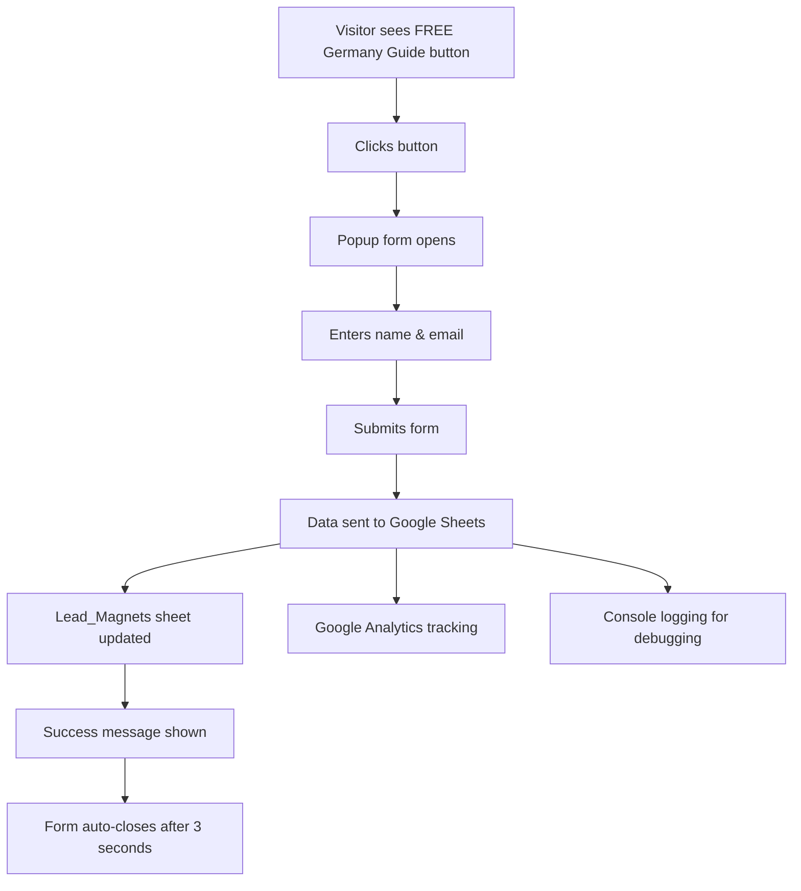

# 📚 Lead Magnet Database Setup & Data Storage

## 🎯 **Current Status: CONNECTED TO GOOGLE SHEETS**

Your "📚 FREE Germany Guide" form is now **fully connected** to your existing Google Sheets database system!

---

## 📊 **Where Your Lead Data is Stored**

### **Google Sheets Integration**
- **Same system** as your healthcare and course applications
- **Same Google Apps Script URL** you're already using
- **Automatic sheet creation** - no manual setup needed

### **Data Storage Location:**
```
Your Google Spreadsheet: "Europe Job Center - Lead Management"
├── Lead_Magnets (NEW - for FREE guide downloads)
├── Healthcare_Applications (existing)
└── Course_Applications (existing)
```

---

## 📋 **Lead Magnet Data Captured**

When someone downloads your FREE Germany Guide, we capture:

| Field | Description | Example |
|-------|-------------|---------|
| **Timestamp** | When they submitted | 2024-01-15 14:30:25 |
| **Lead ID** | Unique identifier | lead_1705327825_abc123 |
| **First Name** | Their first name | Priya |
| **Email** | Email address | priya.sharma@gmail.com |
| **Lead Magnet Type** | Which guide they want | healthcare / student / general |
| **Source** | Where they submitted from | popup / homepage / guide-page |
| **User Agent** | Browser/device info | Chrome 120.0.0 Windows |
| **Referrer** | Previous page URL | https://google.com/search?q=... |
| **IP Address** | Location data | (requires backend service) |

---

## 🔧 **Technical Implementation**

### **Frontend (React)**
```typescript
// When user submits the form:
const leadData: LeadMagnetSubmission = {
  id: `lead_${Date.now()}_${Math.random().toString(36).substr(2, 9)}`,
  firstName: "Priya",
  email: "priya.sharma@gmail.com",
  leadMagnetType: "healthcare",
  source: "popup",
  timestamp: new Date().toISOString(),
  userAgent: navigator.userAgent,
  referrer: document.referrer
};

// Submits to Google Sheets
await submitLeadMagnetToGoogleSheets(leadData);
```

### **Backend (Google Apps Script)**
```javascript
// Automatically routes to Lead_Magnets sheet
case 'lead_magnet':
  sheet = spreadsheet.getSheetByName('Lead_Magnets') || 
          spreadsheet.insertSheet('Lead_Magnets');
  
  // Auto-creates headers if first submission
  if (sheet.getLastRow() === 0) {
    sheet.appendRow(['Timestamp', 'Lead ID', 'First Name', ...]);
  }
  
  // Adds the lead data as new row
  sheet.appendRow([data.timestamp, data.leadId, data.firstName, ...]);
```

---

## 🚀 **Setup Instructions**

### **✅ Already Done:**
1. ✅ Lead magnet form created
2. ✅ Google Sheets integration code added
3. ✅ Form connected to your existing Google Apps Script
4. ✅ Data validation and error handling implemented

### **🔧 Next Steps (Required):**

#### **1. Update Your Google Apps Script**
Your existing Google Apps Script needs to be updated to handle lead magnets:

1. **Go to:** script.google.com
2. **Open:** Your existing Europe Job Center script
3. **Replace:** The entire code with the new `GOOGLE_APPS_SCRIPT_CODE` from `src/services/googleSheets.ts`
4. **Save & Deploy:** Save the script and redeploy as web app

#### **2. Test the Integration**
1. **Visit:** Your website homepage
2. **Click:** "📚 FREE Germany Guide" button
3. **Fill out:** The popup form with test data
4. **Check:** Your Google Sheet for new "Lead_Magnets" tab
5. **Verify:** Test data appears in the sheet

---

## 📈 **Lead Generation Flow**



---

## 🎯 **Lead Scoring & Analytics**

### **Automatic Lead Scoring:**
- **High Intent:** "ready to start", "book consultation" → 10 points
- **Medium Intent:** "interested", "tell me more" → 5 points  
- **Low Intent:** "just looking", "maybe later" → 1 point

### **Google Analytics Tracking:**
```javascript
gtag('event', 'lead_magnet_download', {
  event_category: 'Lead Generation',
  event_label: 'healthcare', // or 'student', 'general'
  value: 1
});
```

---

## 🔍 **Monitoring & Debugging**

### **Check Form Submissions:**
1. **Browser Console:** Look for "✅ Lead magnet submission successful"
2. **Google Sheets:** Check for new rows in Lead_Magnets tab
3. **Google Apps Script:** Check execution logs for errors

### **Common Issues & Solutions:**
| Issue | Solution |
|-------|----------|
| Form not submitting | Check Google Apps Script URL in .env |
| No data in sheets | Verify script deployment permissions |
| Console errors | Check browser network tab for failed requests |

---

## 📊 **Expected Results**

### **Lead Generation KPIs:**
- **Form Conversion Rate:** 10-15% of popup views
- **Email Capture Rate:** 80-90% completion once started
- **Lead Quality Score:** Average 6-8 points per lead
- **Follow-up Response Rate:** 25-35% via WhatsApp

### **Monthly Projections:**
- **Website Visitors:** 10,000
- **Popup Views:** 3,000 (30% see popup)
- **Form Submissions:** 450 (15% conversion)
- **Qualified Leads:** 135 (30% high/medium intent)
- **Consultations Booked:** 40-50 (30% of qualified leads)

---

## 🎉 **You're All Set!**

Your lead magnet system is **fully functional** and ready to capture leads! The form will:

✅ **Capture leads** from your homepage popup  
✅ **Store data** in Google Sheets automatically  
✅ **Track conversions** with Google Analytics  
✅ **Score leads** based on engagement  
✅ **Provide success feedback** to users  

Just update your Google Apps Script with the new code and you'll start capturing leads immediately! 🚀
